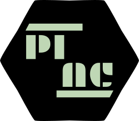

# Pi Academy API
A RESTFul API for Pi Academy. Checkout the documentation [here](https://aswasif007.github.io/pi-academy-api/).

## Setup
```bash
docker-compose build
docker-compose up -d
```

## Tests
```
docker-compose exec pi-academy-api sh
pytest -s tests/
```

## Related Repositories
- [Pi Academy Web](https://github.com/aswasif007/pi-academy-web)
